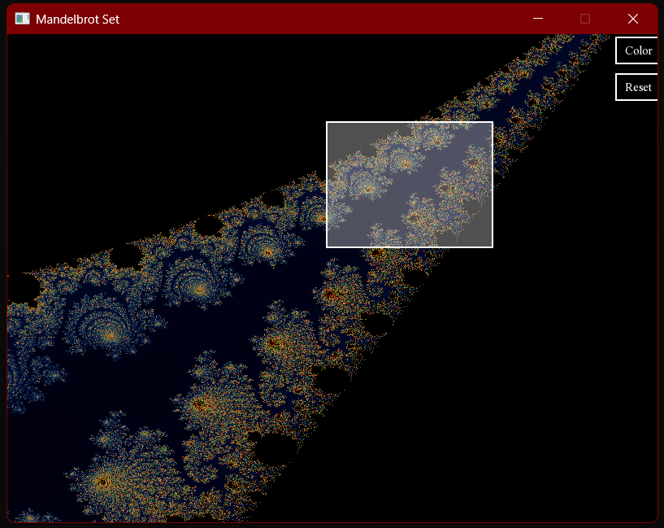
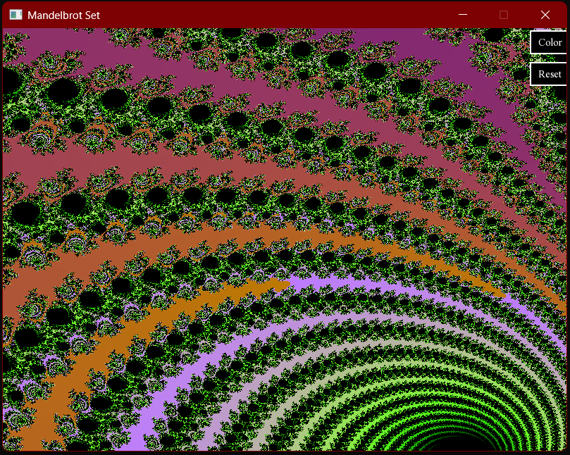

# Mandelbrot Set Renderer

GPU-accelerated Mandelbrot fractal renderer written in C++ using OpenCL and SFML.

## Preview

<p align="center">
  
  
</p>

## Features

- Mandelbrot fractal rendering
- GPU acceleration with OpenCL
- Interactive zooming
- Zoom by mouse selection
- Mouse wheel zoom
- Multiple color schemes
- Real-time rendering with SFML

---

## Technologies

- C++
- OpenCL
- SFML

---

## Requirements

To build and run this project you need:

- C++17 compatible compiler
- OpenCL SDK/runtime
- SFML 2.x
- Visual Studio (recommended)

---

## Required Libraries

### SFML

Project uses:

```cpp
#include <SFML/Graphics.hpp>
```

You need SFML graphics, window and system modules.

Download SFML from:

https://www.sfml-dev.org/

---

### OpenCL

Project uses:

```cpp
#include <CL/cl.h>
```

You need:

- OpenCL runtime
- GPU drivers with OpenCL support

For NVIDIA install CUDA drivers.

For AMD install Adrenalin drivers.

For Intel install Intel OpenCL Runtime.

---

## Project Structure

```text
Application.cpp
Application.h
MandelbrotSet.h
main.cpp
mandelbrot.cl
```

---

## Build Instructions (Visual Studio)

### 1. Configure SFML Include Directories

Project Properties -> C/C++ -> General -> Additional Include Directories

Add:

```text
path/to/SFML/include
```

---

### 2. Configure SFML Library Directories

Project Properties -> Linker -> General -> Additional Library Directories

Add:

```text
path/to/SFML/lib
```

---

### 3. Link Required Libraries

Project Properties -> Linker -> Input -> Additional Dependencies

Release build:

```text
sfml-graphics.lib
sfml-window.lib
sfml-system.lib
OpenCL.lib
```

Debug build:

```text
sfml-graphics-d.lib
sfml-window-d.lib
sfml-system-d.lib
OpenCL.lib
```

---

## Runtime Requirements

The following files must be located in the same directory as the executable:

### SFML DLLs

Release:

```text
sfml-graphics-2.dll
sfml-window-2.dll
sfml-system-2.dll
```

Debug:

```text
sfml-graphics-d-2.dll
sfml-window-d-2.dll
sfml-system-d-2.dll
```

### OpenCL

```text
OpenCL.dll
```

### OpenCL Kernel

```text
mandelbrot.cl
```

### Font

```text
TimesNewRoman.ttf
```

---

## Running

Open the solution in Visual Studio and run the project.

The application automatically:

- searches for an OpenCL GPU device
- falls back to CPU if GPU is unavailable
- renders the Mandelbrot set in real time

---

## Controls

| Action         | Control         |
| -------------- | --------------- |
| Zoom selection | Left mouse drag |
| Zoom by cursor | Mouse wheel     |
| Change colors  | Color button    |
| Reset zoom     | Reset button    |

---

## Notes

- GPU rendering requires OpenCL-compatible hardware.
- If OpenCL kernel compilation fails, verify GPU driver support.
- The project uses double precision (`cl_khr_fp64`).
